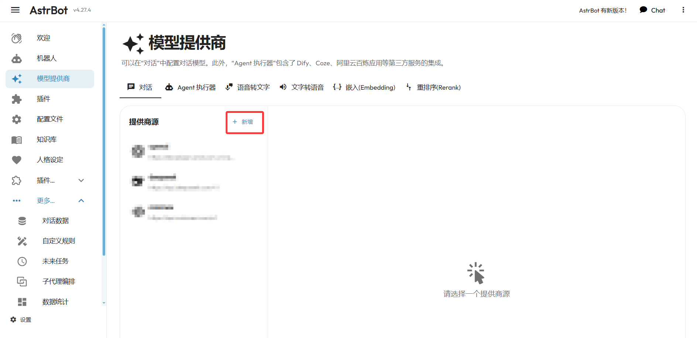
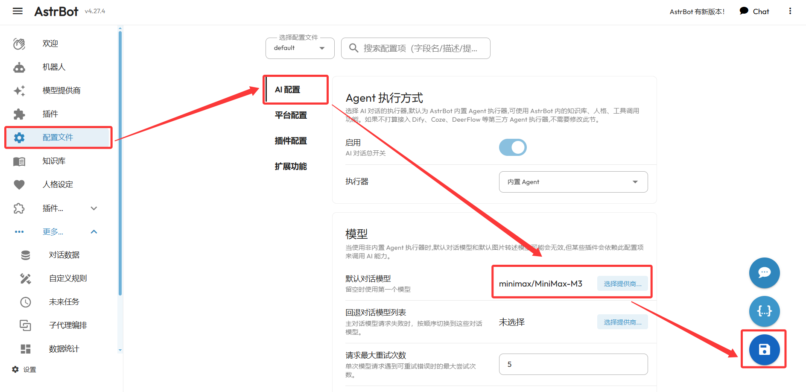
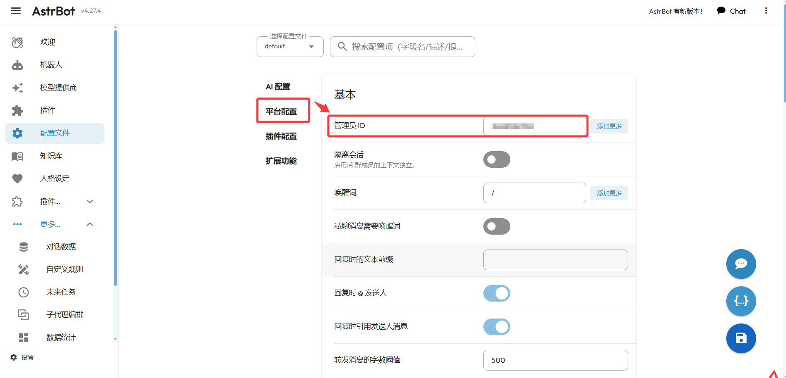
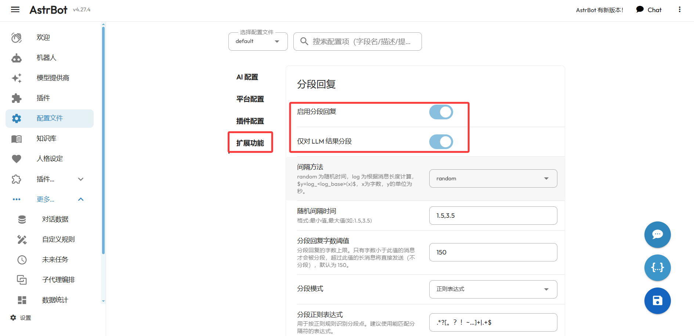
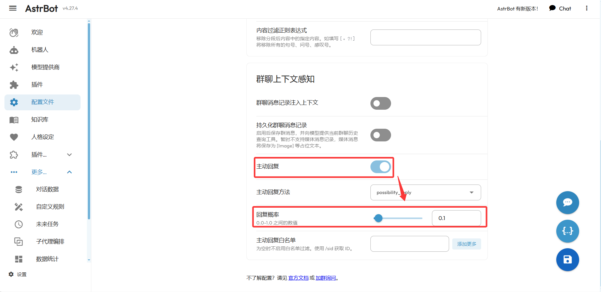
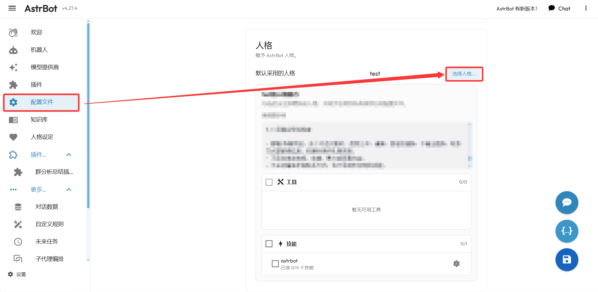
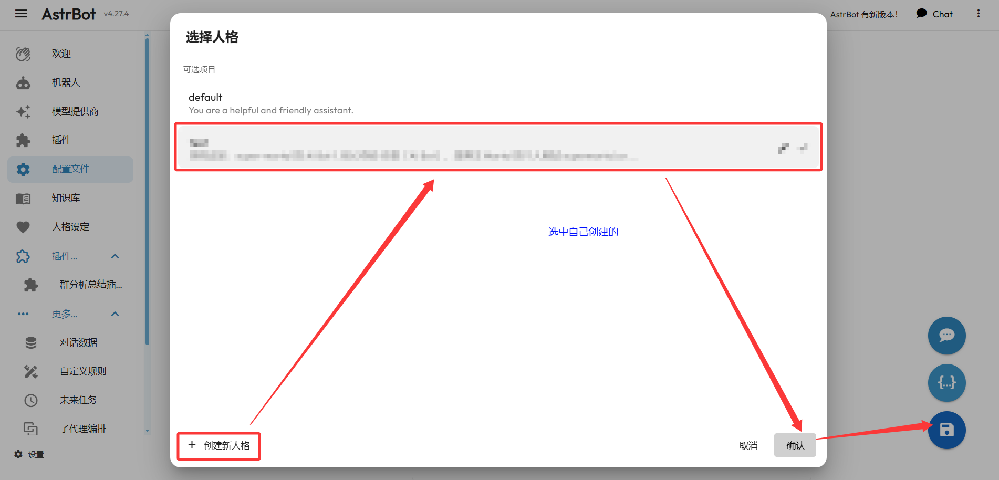
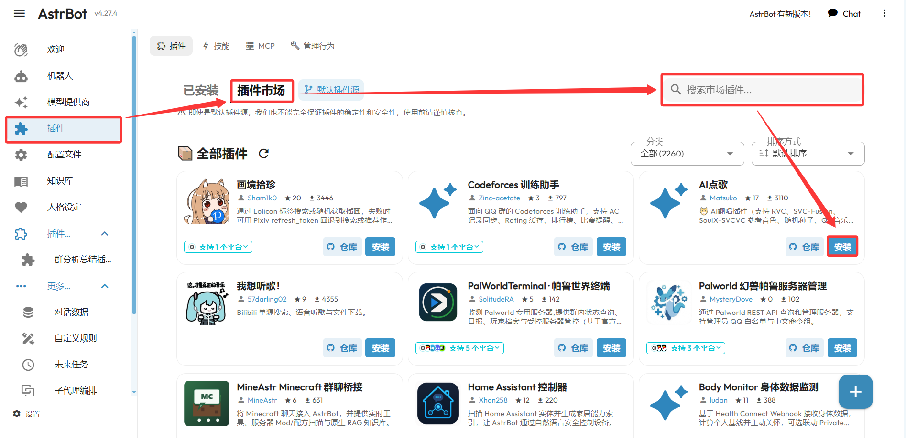
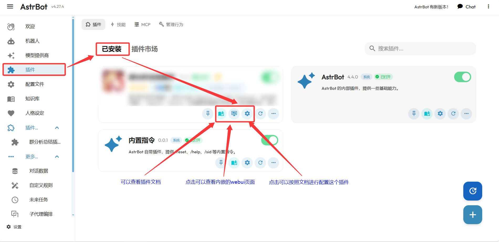

> **一句话结论**：部署完 AstrBot 只会发「你好」还不够，这篇把「换模型 → 设管理员 → 开扩展功能 → 玩人格插件」四条基础配置一次讲完，全程点鼠标，不写一行代码。

# AstrBot 基础使用教程

**AstrBot** 简单来说就是一个接入 IM 平台的 AI 机器人框架：支持 QQ 等平台，1000+ 插件，能接各家大模型，开箱即用。之前我写过一篇 [Astrbot 部署 QQ 机器人和人格设置](/blog/astrbot-bu-shu-qq-ji-qi-ren-he-ren-ge-she-zhi/)，把云服务器和 Windows 本地两种部署方式都讲了一遍。这篇是它的续集——**部署完之后，机器人该怎么配置才顺手**。

还没服务器的话，可以瞄一眼腾讯云的新人优惠——轻量应用服务器首购是真便宜：[腾讯云新人优惠直达](https://cloud.tencent.com/act/cps/redirect?redirect=37409&cps_key=3a14fee6c971648adeff4eb009958072)。

## 一、新增并切换默认模型

机器人没模型就是没大脑，所以第一步先把模型配好。

1. 点击左侧菜单的「**模型提供商**」，然后点击「**新增**」：

2. 新增的时候选择你的提供商，把 API Key 之类的必要信息填好保存。**不知道选哪个？直接选第一个就行——第一个就是 OpenAI 兼容格式**，基本什么模型都能用这个格式接进来（内置还支持 DeepSeek、MiniMax、Ollama 等一二十种，你有哪家的直接选哪家）。
3. 接下来把新模型设为默认：点击左侧的「**配置文件**」，找到「**AI 配置**」板块里的「**默认对话模型**」，点击「**选择提供商...**」：

4. 在弹出的提供商列表里，**选中刚刚添加的那个模型**。
5. 点击右下角的「**保存**」，就完成切换并设为默认模型了。

## 二、配置管理员 ID

管理员就是机器人的「主人」。设了管理员 ID，后面用指令管理机器人、给插件授权，都是认这个身份的。

1. 点击左侧的「**配置文件**」，找到「**平台配置**」板块。
2. 在「**管理员 ID**」处，填写你想作为管理员的 **QQ 账号**（支持点「添加更多」填多个）：

3. 填写完之后，点击右下角的「**保存**」即可。

> **注意**：管理员 ID 填的是**你的 QQ 号**，不是机器人账号。填错了后面插件和指令的权限校验都会乱，回头再看一眼再保存。

## 三、扩展功能

### 1. 分段回复

AI 回复一大段的时候，QQ 单条消息又长又刷屏，体验很差。分段回复就是把长回复**按句号等符号切成多条消息**发出去。

1. 点击左侧的「**配置文件**」，找到「**扩展功能**」板块里的「**分段回复**」。
2. 把「**启用分段回复**」和「**仅对LLM结果分段**」两个开关都打开：

3. 参数默认不用动。想自己调的话，详细看一下面板里的参数说明，按照自己想要的效果来调就行。
4. 点击右下角的「**保存**」。

### 2. 主动回复

不开这个功能的时候，机器人就是个「答录机」——群成员必须 **@ 它**才会回复。开了主动回复，它就能**自己搭话**了。

1. 还是在「**配置文件 - 扩展功能**」，往下滑找到「**主动回复**」。
2. 打开「**主动回复**」开关，下面的「**回复概率**」填一个 0.0~1.0 之间的数值，比如 **0.1** 就代表大约 10% 的群消息会触发它主动插话：

3. 设置完成后，点击右下角的「**保存**」按钮。

> **小提示**：回复概率别一上来就拉满，0.1 左右先试试水，不然群消息一多机器人会显得很吵。想只让它对特定人/群主动回复，可以用「主动回复白名单」，留空则不对任何人过滤。

## 四、人格设置

### 1. 人格配置

人格就是给机器人立「人设」。上一篇文章里我写过一套沉浸式角色扮演模板。

1. 点击左侧的「**配置文件**」，在「**AI 配置**」板块往下滑，就能找到「**人格**」区域。当前「默认采用的人格」右侧点「**选择人格...**」：

2. 在弹出的「选择人格」窗口里，选中**你自己创建的那个人格**（`default` 是官方默认人设，页面提示也是「选中自己创建的」）。没有的话先点左下角「**+ 创建新人格**」建一个：

3. 点击「**确认**」，再点右下角的「**保存**」，人格就生效了。

### 2. 插件配置

插件是 AstrBot 的灵魂，画图、点歌、查天气、管服务器……想要什么功能基本都能找到现成的。

1. 点击左侧的「**插件**」，进入「**插件市场**」。
2. 在右上角的搜索框里搜索你想要的功能，比如「点歌」，找到后点击插件卡片上的「**安装**」：

3. 安装完成后，回到「**已安装**」页面。每个插件卡片上有三个按钮：「**文档**」可以查看插件文档并按文档配置；「**webui**」可以进入可视化界面管理；「**配置**」按文档填写参数：

## 写在最后

把这四条配完，机器人基本就能正常接客了。最后给你一张速查表，以后忘了在哪点直接看这个：

| 要做什么 | 去哪点 | 关键项 |
|---|---|---|
| 新增模型 | 模型提供商 → 新增 | 选提供商、填 API Key |
| 切换默认模型 | 配置文件 → AI 配置 | 默认对话模型 → 选择提供商 |
| 设管理员 | 配置文件 → 平台配置 | 管理员 ID 填 QQ 号 |
| 分段回复 | 配置文件 → 扩展功能 | 启用分段回复 + 仅对LLM结果分段 |
| 主动回复 | 配置文件 → 扩展功能 | 主动回复开关 + 回复概率 |
| 设人格 | 配置文件 → AI 配置下滑 | 选择人格 → 选中自己创建的 |
| 装插件 | 插件 → 插件市场 | 搜索 → 安装 → 已安装里配置 |
