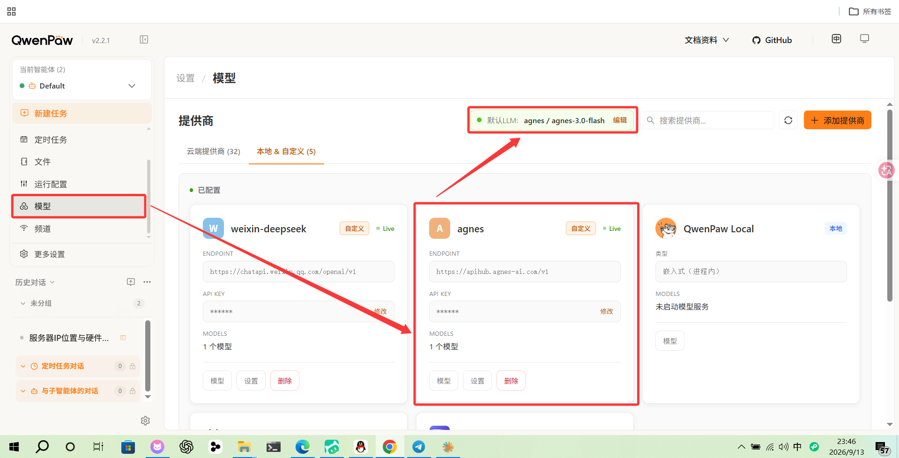
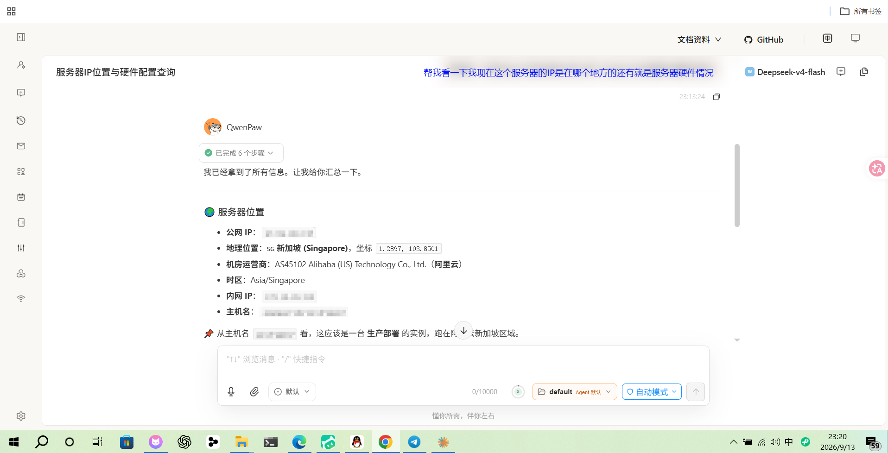
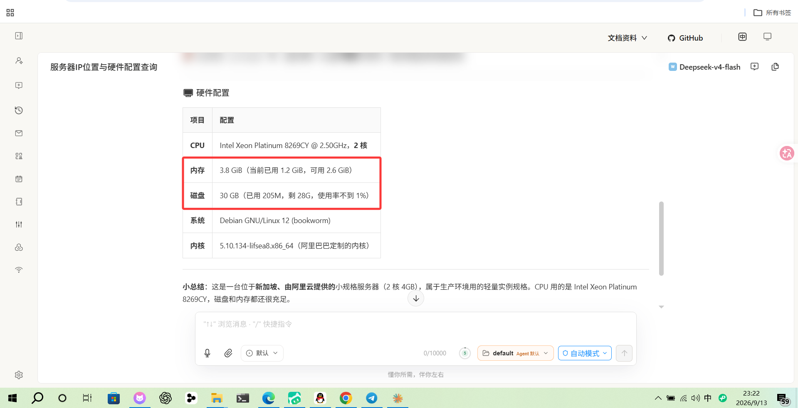
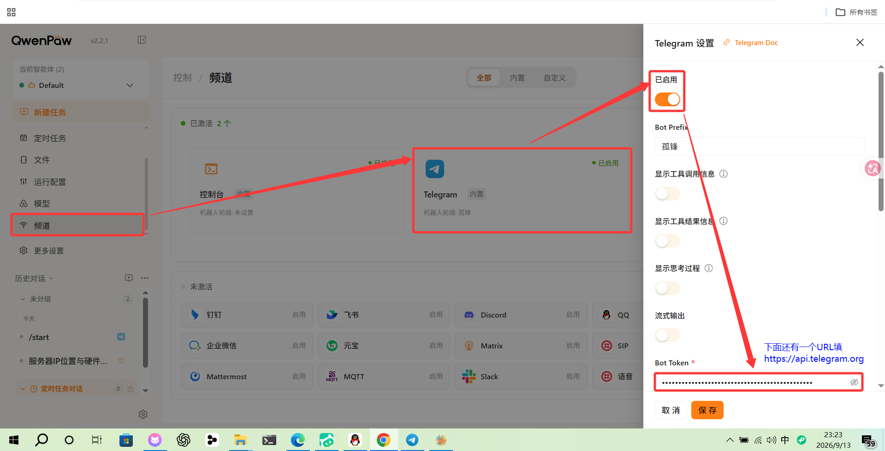
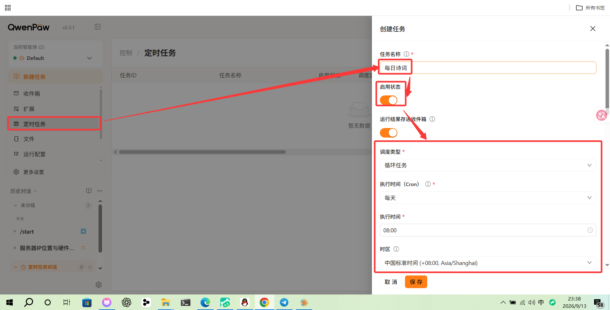
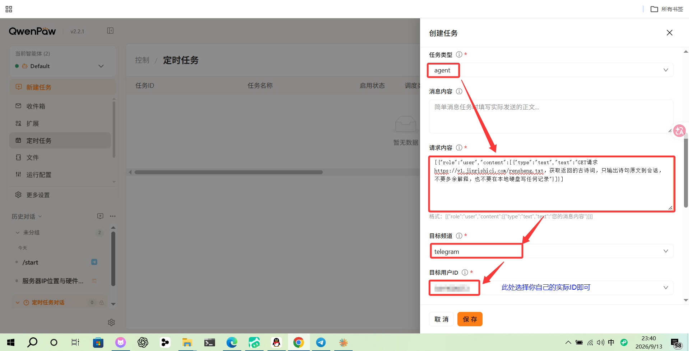
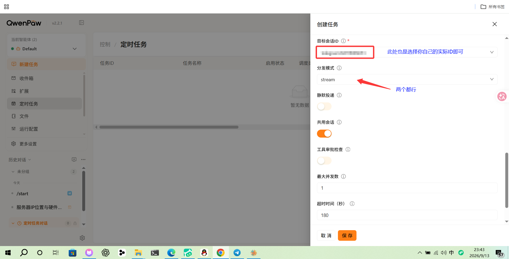
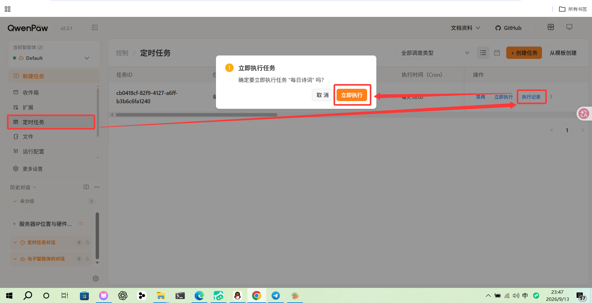
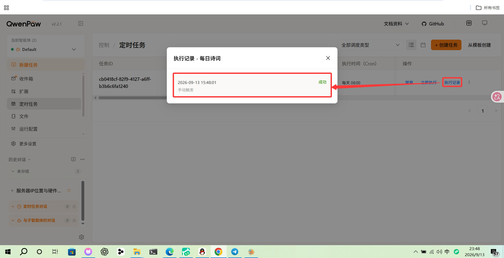

> **一句话结论**：绑定 GitHub 永久领到一只阿里云 2 核 4G 的云端 QwenPaw，挂一条定时任务就能长期保活，国内节点直接接国内 IM 即可

## 一.背景与准备

- **QwenPaw**：阿里通义 AgentScope 团队开源的个人 AI 智能体，数据本地、支持多渠道（钉钉/飞书/QQ/元宝/Telegram/Discord）
- **AgentScope Platform**：官方云端体验平台，公测期间**绑定 GitHub 就能永久领一个免费的 7×24 实例**，不用自己买服务器

### 1.前置准备

- 一个 GitHub 账号（用作平台唯一身份，公测每人限领 1 只）
- 一个邮箱（注册用，不限阿里系）
- 一个国内或海外 IM 账号（可选，接 IM 用；本教程以 Telegram 演示，国内节点可以换成 QQ机器人 / 腾讯元宝 / 飞书 / 钉钉等）

## 二.注册并部署

打开 [https://platform.agentscope.io/](https://platform.agentscope.io/)，邮箱注册后按提示授权 GitHub。绑定成功后**进到部署页面**，选择**稳定版**点击部署，等几分钟就会自动跳到工作台页面，看到下面这行就说明准备完成：

```text
14:02:11 [SYSTEM] Mounting workspace files...
QwenPaw workspace ready ✓
```

## 三.配置模型（必做）

QwenPaw 本身只是个壳，必须挂上 LLM 才能回答问题。**平台内置的免费模型用不了**，需要自己接外部 API Key 才能正常聊天

左侧菜单 → **设置 → 模型**，提供商按类目分了 tab，自己接的 API 一般选**自定义** tab 下面添加。右上角 **添加提供商**，按 OpenAI 兼容格式填三项：

| 字段     | 示例（以 [agnes](https://agnes-ai.com/) 为例）                    |
| -------- | --------------------------------------------------- |
| 类型     | 自定义                                              |
| Endpoint | `https://apihub.agnes-ai.com/v1`                   |
| API Key  | 你申请到的 Key                                      |
| Models   | 该提供商下的模型名，如 `agnes-3.0-flash`            |

保存后回到列表，在你要用的提供商卡片右上角点 **设置** 设为默认 LLM：



## 四.看看分到了哪个节点 + 能接哪些 IM

> **注意**：AgentScope Platform 用 K8s 调度，**每次开实例所在机房不一定一样**。所以**必须先查一下自己被分到了哪个节点**，这一步决定你能接哪些 IM

模型配好之后，直接问 QwenPaw 帮你查一下：





> **小提示**：节点区域决定能接哪些 IM
> - 分到**海外节点**（如新加坡/香港）：Telegram Bot API 默认能通，可以直接接 Telegram
> - 分到**大陆节点**：Telegram 直连不通，建议直接接**国内 IM**——QQ机器人、腾讯元宝、飞书、钉钉等都行，一个都不用挂代理

## 五.接入 IM（可选）

QwenPaw 一套实例能接一堆 IM。以 Telegram 为例（**国内节点请换成本节列的国内 IM**）：左侧菜单 → **控制 → 频道**，Telegram 卡片内打开「已启用」开关：



## 六.保活（核心）

> 平台实例48小时不发消息会自动关机，所以我们可以配置个定时任务，每天定时向 Telegram 机器人发个消息以达到保活效果

### 1.创建定时任务

**控制 → 定时任务 → 创建任务**：



### 2.改成 agent 类型，配置任务内容

任务保存后点 **编辑**，把类型改成 `agent`，**请求内容** 填：



```json
[{"role":"user","content":[{"type":"text","text":"GET 请求 https://v1.jinrishici.com/rensheng.txt，获取返回的古诗词，只输出诗句原文到会话，不要多余解释，也不要在本地硬盘写任何记录"}]}]
```

继续往下滚配置目标渠道和分发模式：



### 3.手动触发 + 看执行记录

任务列表右边点 **立即执行**：



弹窗点 **立即执行**，等几秒后看执行记录：



显示「成功」就说明保活链路打通了

## 七.写在最后

公测薅羊毛够用了：2 核 4G + 7×24 在线 + 永久免费 + 多渠道接入，配个保活任务基本就是一个长期挂着的私人助理。
