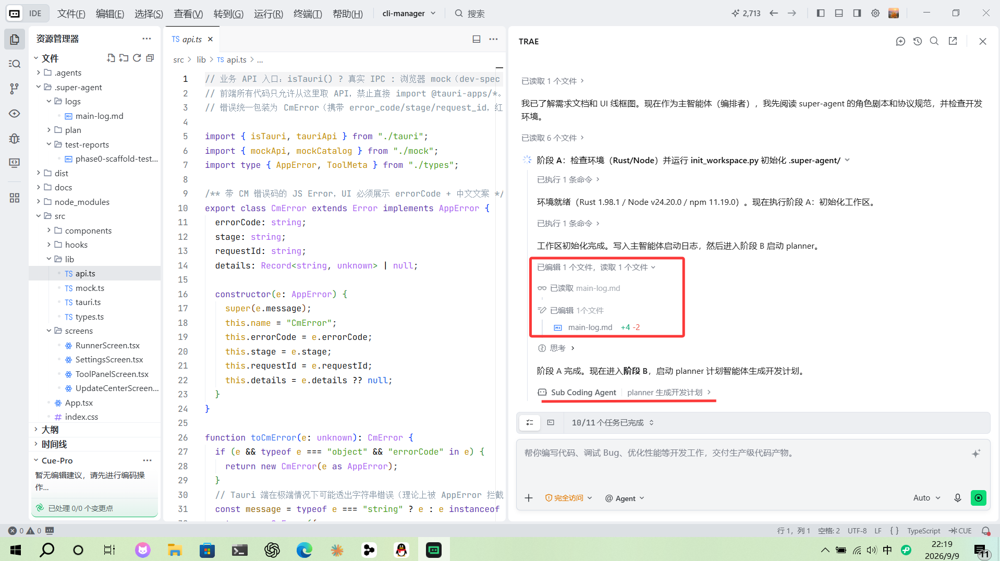
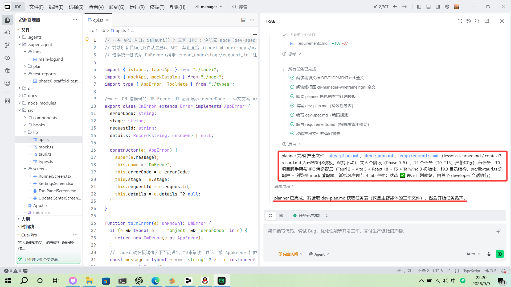
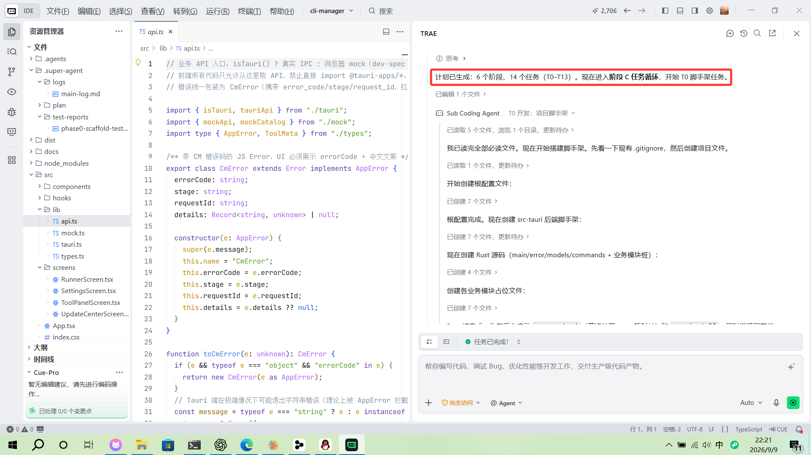
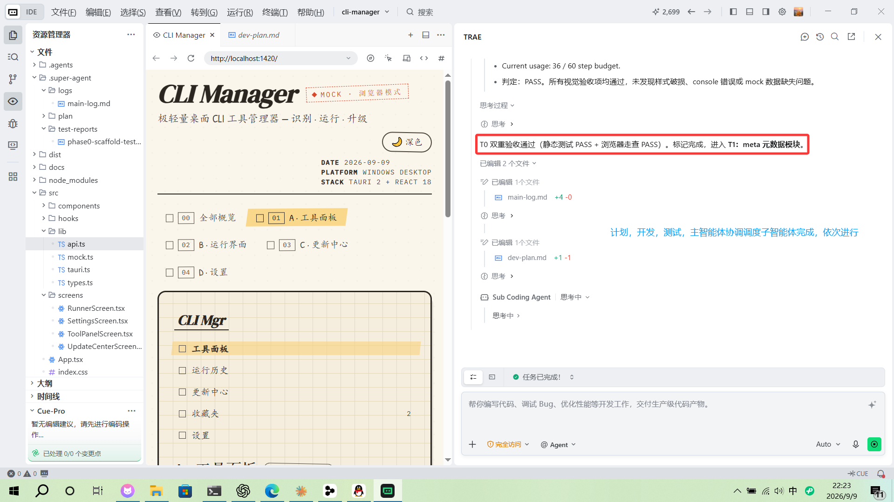
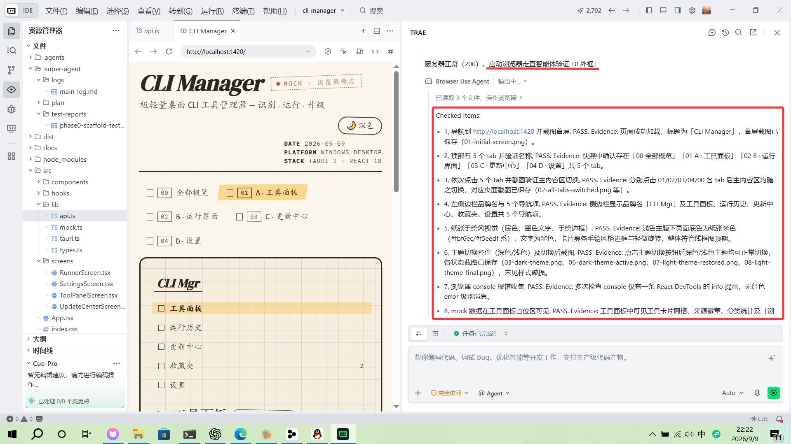
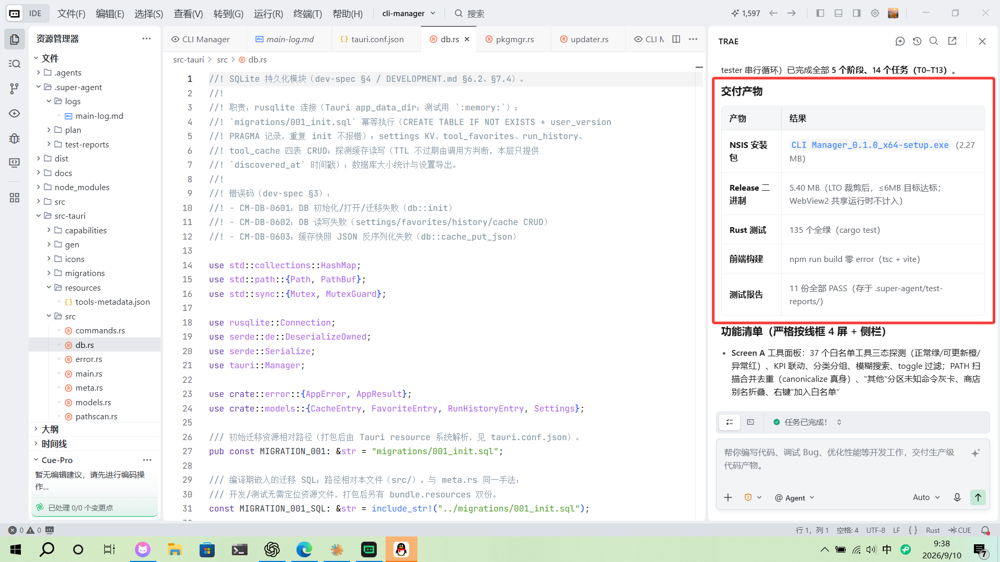

> **一句话结论**：我把「多智能体协同开发」封装成了一个开箱即用的 AI Skill —— 加载后 AI 会按「计划 → 开发 → 测试 → 修正」的工程化流程干活，主智能体只调度不写码，修 bug 靠 resume 同 ID 保住上下文。已开源（MIT），也在腾讯 SkillHub 发布了。

# Super Agent

## 为什么写这个东西

先说动机。我用 AI 写代码的时间不算短，但每次把一个大项目丢给单个 agent 从头做到尾，总会撞上三个瓶颈：

| 瓶颈 | 具体表现 |
|---|---|
| **上下文窗口爆炸** | 对话一长，模型注意力就散了，连自己之前为什么这么写都记不住 |
| **修 bug 失忆** | 改 bug 的时候，agent 已经忘了当初的实现意图、忘了测试报告里的具体缺陷 |
| **测试与开发互相污染** | 写代码的 agent 自己测自己的代码，永远缺一个独立审查的视角 |

我试过手动拆任务、手动切对话，也能跑，但每次都要重复一套流程，太折腾。后来想明白了：与其每次手搓，不如把整套「角色分工 + 修正循环」固化成一份可加载的 Skill。于是就有了 **Super Agent**。

## 它是什么

**Super Agent** 是一个 AI Agent Skill：加载之后，AI 会按「**计划 → 开发 → 测试 → 修正**」的工程化流程推进项目，而不是一口气把代码写完就交差。

简单来说，它给 AI 配了一个「**项目经理 + 一支分工明确的团队**」：

| 角色 | 剧本文件 | 职责 |
|---|---|---|
| **主智能体**（编排者） | `agents/orchestrator.md` | 拆任务、调度、写日志、判 PASS/FAIL。**永不修改业务代码**，就是个包工头 |
| **计划智能体** | `agents/planner.md` | 读需求文档，一次性生成 `dev-plan.md` 和 `dev-spec.md`，整个流程只跑一次 |
| **开发智能体** | `agents/developer.md` | 按单个任务写代码、记录变更、修 bug |
| **测试智能体** | `agents/tester.md` | 只读审查、写测试报告。**也不修改业务代码**，保证独立视角 |
| **评估智能体**（可选） | `agents/grader.md` | 回归评估，输出 `benchmark.json` |

五个角色都有独立的剧本文件，你可以按项目替换，但**不能改**主智能体的串行调度、同 ID resume 和上下文隔离规则。

## 核心机制：角色分离 + 修正循环

### 修正循环：修 bug 不失忆的关键

测试不通过时，不是重新开一个 agent，而是 **resume 同一个 agent**：

```
开发 Agent（新 ID）→ 测试 Agent（新 ID）
 ↑                    │
 │                    │ FAIL
 └── resume 同一 dev ←┘
      （修完）
      ↓
      resume 同一 tester（重测）
```

为什么这么设计？因为**上下文就是记忆**。重开一个新 agent 等于让一个失忆的人来修 bug——它看不到当初写代码时的思路，只能瞎猜。resume 同 ID，才能保证「我当初为什么这么写」「测试报告里具体哪里不达标」这些信息还在脑子里。

> **注意**：同一任务最多测 **5 轮**，第 5 轮仍 FAIL 就标记 ⚠️ 强制通过，不阻塞后续任务。防止死循环耽误总进度。

### 五条不可破坏的原则

| 原则 | 含义 |
|---|---|
| **文件即记忆** | 所有产出（计划、代码、报告、经验）落盘到批次目录，不依赖对话上下文 |
| **隔离即常态** | 每个子智能体只看到主智能体传过去的内容，假设它什么业务背景都不知道 |
| **记录即保险** | 所有时间由 `scripts/now.py` 获取，禁止推算 |
| **路径即接口** | 主智能体只拿文件路径、不读内容；子智能体收到路径后自己读 |
| **resume 同 ID** | 修 bug resume 同开发 Agent，重测 resume 同测试 Agent，新任务开新 Agent |

### 为什么必须严格串行

这个 skill 里所有智能体调用必须**严格串行**，包括测试子代理之间。这不是性能取舍，而是保护 resume 机制和上下文隔离的设计前提。违反任何一条都算破坏这个 skill：

1. 主智能体修改业务代码 → 严格禁止
2. 一个任务对应一个 dev Agent → 禁止复用同 ID dev 处理多个任务
3. 下一个任务必须等当前任务完全完成（含修正循环）
4. 测试子代理之间必须串行，不能多个 tester 同时跑
5. tester FAIL → 修 bug 必须 resume 同一 dev Agent
6. dev 修完 → 重测必须 resume 同一 tester Agent
7. 跨 role 并行（如前后端同时跑）→ 不允许
8. 更新 `dev-plan.md` 只能用 Edit 单行替换，禁止 Write 覆盖整个文件

## 真实跑通：在 TRAE 里开发 CLI Manager

光说不练假把式，我直接用它在 TRAE 里跑了一个真实项目：**CLI Manager**（极轻量桌面 CLI 工具管理器，Tauri 2 + React 18 技术栈，识别·运行·升级一条龙）。需求文档和 UI 线框图丢给它，剩下的全看它自己表演。

### 阶段 A：加载 skill，自动初始化

加载 skill 后只给了一句话需求，它先检查环境（Rust 1.98.1 / Node v24.20.0），然后跑 `init_workspace.py` 创建独立批次目录，所有产出都会落在里面，不污染对话上下文：



### 阶段 B：planner 生成完整计划

初始化完进入阶段 B，启动 planner 计划智能体。它读需求文档和线框图后，一次性产出 `dev-plan.md`（阶段任务表）、`dev-spec.md`（编码规范）、`requirements.md`（需求摘要）：



### 阶段 C：任务循环，逐个开发 + 独立测试

计划就绪后进入任务循环，每个任务都是「新 dev → 新 tester → 判定 PASS/FAIL」。T0 脚手架任务里，开发智能体一口气创建了根配置 7 个、后端 7 个、Rust 源码 4 个、业务模块占位 7 个文件：



### 验收：双重验收 + 浏览器走查

每个任务完成后不是它自己说了算，要过**静态测试 + 浏览器走查**双重验收。T0 完成后判定 PASS，才放行进入 T1 元数据模块：



走查环节用的是浏览器自动化 Agent，8 项检查（页面加载、5 个 tab 切换、侧栏导航、纸张手绘风视觉、深浅主题切换、console 无报错、mock 数据可见）逐项验证并留存截图证据：



### 结果：14 个任务全部完成

整个项目 5 个阶段、14 个任务全部跑完，**11 份测试报告全部 PASS**：



从晚上 9 点干到第二天早上 9 点半，**任务耗时 11 小时 39 分**——中间我完没全管，全程就是它自己循环。对比以前手动拆任务、手动催进度的日子，效率翻了好几倍。并且我验收的时候，工具上除了加载速度有点小问题是我当初没有考虑到的问题没有写入开发文档之外，其他的包括打包文件什么的是完全跑通并且实测可用了的

## 怎么安装使用

打开技能页 **[skillhub.cn/skills/user_dd51ca54/super-agent](https://skillhub.cn/skills/user_dd51ca54/super-agent)**，复制页面上的安装指令（一句话），粘贴给你的 AI 工具——WorkBuddy、OpenClaw、QClaw 这类支持 SkillHub 的都行，它自己就会装好。WorkBuddy 用户更省事：直接在左侧技能库切到 SkillHub 来源，搜索 `super-agent`，点安装就行。

**依赖**：Python >= 3.10（脚本只用标准库，无第三方依赖）。

加载后启动也很简单，一句话：

```text
加载 super-agent skill，帮我开发 my-project 项目，需求文档在 /path/to/requirements.md
```

它会自动创建批次目录进入阶段循环。所有产出都落在 `<你的项目>/.super-agent/runs/<项目名-日期--批次号>/` 下：计划、测试报告、经验库、最终报告，全部可追溯。

> **小提示**：如果没给需求文档，它会扫描已有批次，列出未完成的批次问你是继续还是新建——相当于自带断点续传。

## 适用 / 不适用

| 场景 | 结论 |
|---|---|
| 长期、可追溯、需要独立审查的开发任务 | ✅ 适用 |
| 有明确需求文档、任务可拆分可独立验证的项目 | ✅ 适用 |
| 修 bug 时需要复用原 Agent 上下文的任务 | ✅ 适用 |
| 一次性小修改 | ❌ 杀鸡用牛刀，agent 直接改就行 |
| 强耦合、无法独立验证的任务 | ❌ 拆了反而更难 |
| 只是回答问题、解释概念 | ❌ 不需要多智能体协作 |

## 写在最后

这次把 super-agent 开源 + 发布 SkillHub，对我来说算是把「多智能体协作」从一次性实验变成了可复用资产。**文件即记忆、隔离即常态、路径即接口**这三条，对我自己写 Agent 工作流也很有启发。

- 开源地址：**[github.com/super-mortal/super-agent](https://github.com/super-mortal/super-agent)**（MIT，欢迎 Star ⭐）
- SkillHub 发布页：**[skillhub.cn/skills/user_dd51ca54/super-agent](https://skillhub.cn/skills/user_dd51ca54/super-agent)**（v0.0.2，AI 评分 4.6）

如果你也在折腾多智能体，或者想让 AI 开发流程变得可追溯、可审查，欢迎拿去试试。
