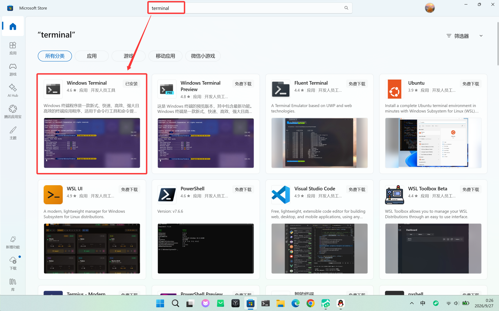
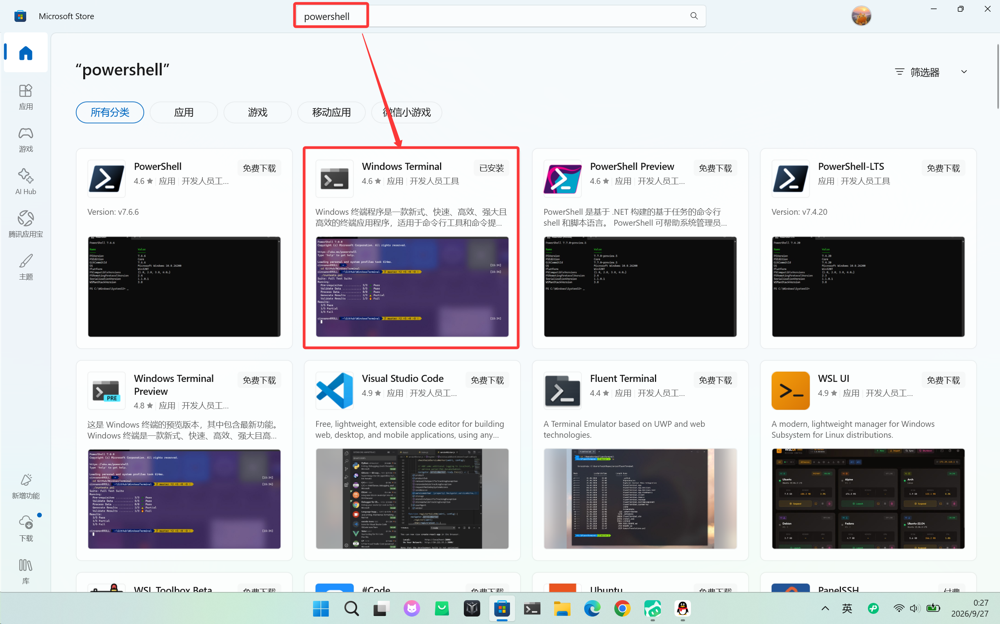
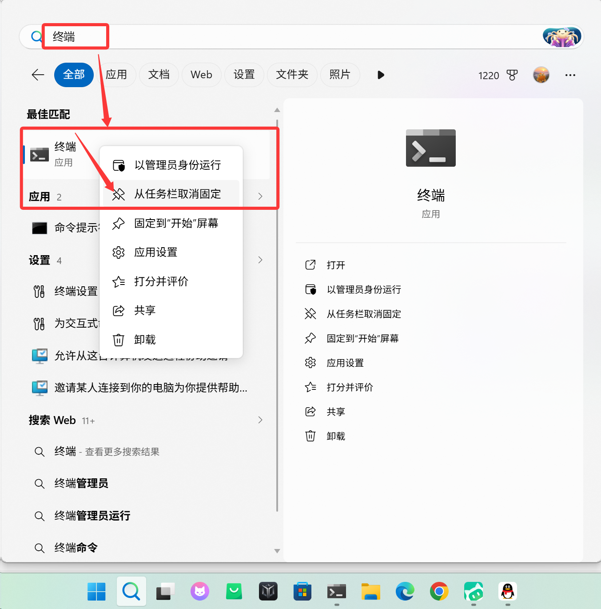
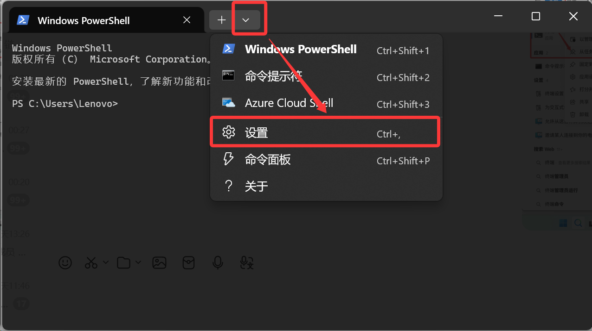
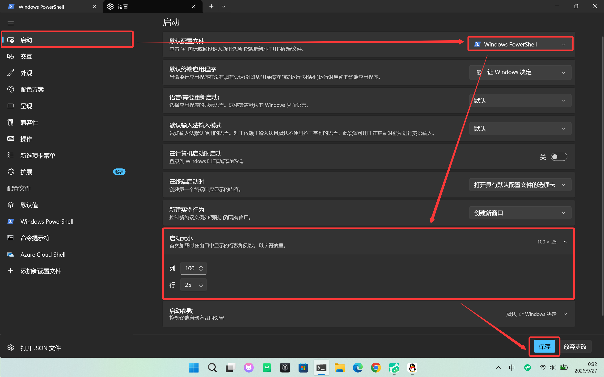
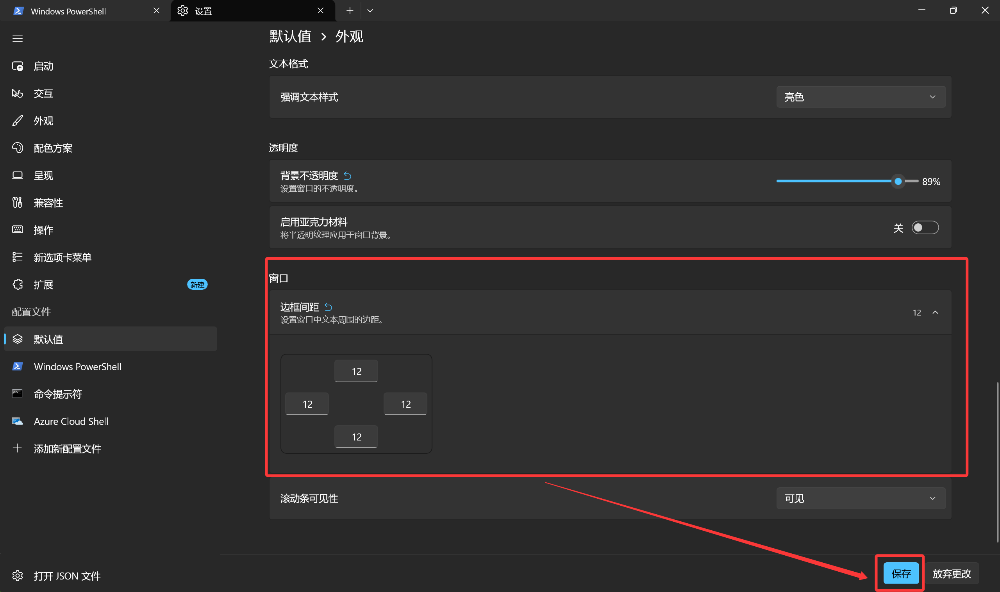
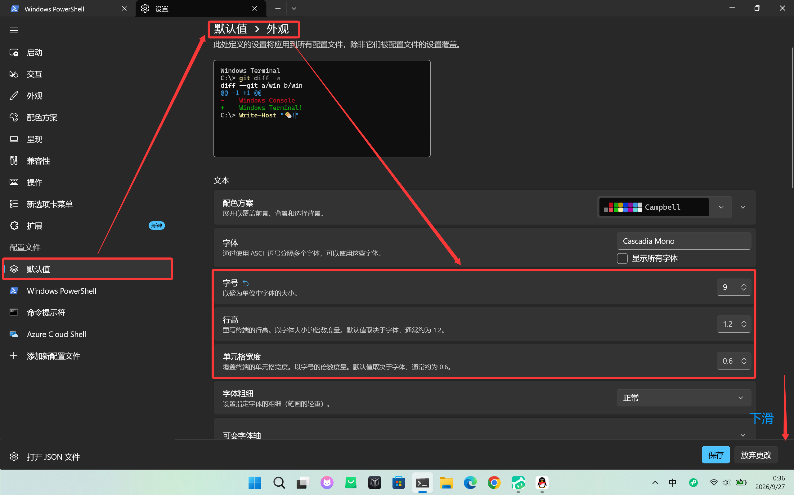

> **一句话结论**：Windows Terminal + PowerShell 7，把 Windows 侧的命令行底座一次搭好，从此告别蓝色老窗口。

现在很多 AI 编程工具都依赖一个靠谱的终端环境，终端好不好用，直接决定你折腾的效率。以前 Windows 用户只能忍着 `cmd.exe` 或者那个老旧的 PowerShell 蓝色窗口：没有多标签、没有配置化、复制粘贴都不太顺手，一个字——丑。如今 **Windows Terminal + PowerShell 7** 已经是 Windows 开发的标准配置，装完你就知道差距在哪了。

## 先分清两个东西：终端和 Shell

动手之前先分清两个概念，不然后面容易绕晕：

- **终端（Terminal）**：你看到的那扇"窗口"，负责展示和输入。
- **Shell**：窗口里跑的命令解释器，你敲的命令由它翻译执行。

简单来说，终端是"饭店大厅"，Shell 是"后厨"。以前 Windows 是把大厅和后厨焊死的（CMD 窗口只能配 cmd.exe），现在终于能自由搭配了。Windows Terminal 就是微软出的现代化终端模拟器，开源、支持多标签，一个窗口里能开 CMD、PowerShell、WSL 多种环境，随便切。

| 组件 | 推荐选择 | 理由 |
|---|---|---|
| **终端模拟器** | **Windows Terminal** | 目前 Windows 上最好的终端入口，没有之一 |
| **Shell（原生）** | **PowerShell 7 (Core)** | 比系统自带的 PowerShell 5.1 更快、跨平台、功能更强 |

## 安装

### 1. 装 Windows Terminal

打开 Microsoft Store（商店），搜索 `terminal`，装 **Windows Terminal**：

### 2. 装 PowerShell 7

还是在商店，搜 `powershell`，装 **PowerShell**：

> **注意**：认准**黑色图标**那个 PowerShell，蓝色图标的是系统自带的旧版 Windows PowerShell 5.1，别装错了。另外安装时如果开着代理，商店可能下载失败，先关掉代理再装。

## 配置

### 1. 固定到任务栏

搜索"终端"，右键选择**固定到任务栏**。以后单击任务栏图标就能打开，不用每次翻开始菜单：

### 2. 进入设置

打开终端，点窗口标题栏的下拉箭头，选**设置**（快捷键 `Ctrl+,`）：

### 3. 设置默认启动

在设置左侧点**启动**，改三个地方：

- **默认配置文件**：选刚装的 **PowerShell**。不选的话，打开还是老的蓝色窗口，等于白装。
- **启动大小**：我喜欢 **100 × 25**（列 × 行），窗口不会太小挤得慌，也不会太大占满屏。
- **在计算机启动时启动**：默认是关的，想开机就自动开终端的打开它就行。

## 外观调教（我的习惯数值）

进**配置文件 → 默认值 → 外观**，下面几个是我用下来比较顺手的数值，分享给你参考：

- **边框间距**：12（四个方向都设 12，文字不会贴边）
- **背景不透明度**：89%（稍微透一点点，能隐约看到后面的窗口，但不影响阅读）
- **字号**：9
- **行高**：1.2
- **单元格宽度**：0.6

> **小提示**：这些数值是我自己用着舒服的参数，没有标准答案，按你的屏幕分辨率和喜好调就行。

全部配置完，记得点右下角**保存**。

## 使用

之后从任务栏点开终端，默认就是 PowerShell 7，直接开干。日常写命令、跑脚本、切 WSL，都在这个窗口里搞定，不用再开一堆乱七八糟的黑色窗口。

## 总结

| 组件 | 用什么 |
|---|---|
| **入口** | Windows Terminal |
| **日常操作** | PowerShell 7 |

别再用老旧的 CMD 了。一个窗口装下 CMD、PowerShell、WSL，还能自定义外观——这套底座搭好，后面折腾 AI 编程工具、跑脚本都顺手很多。
